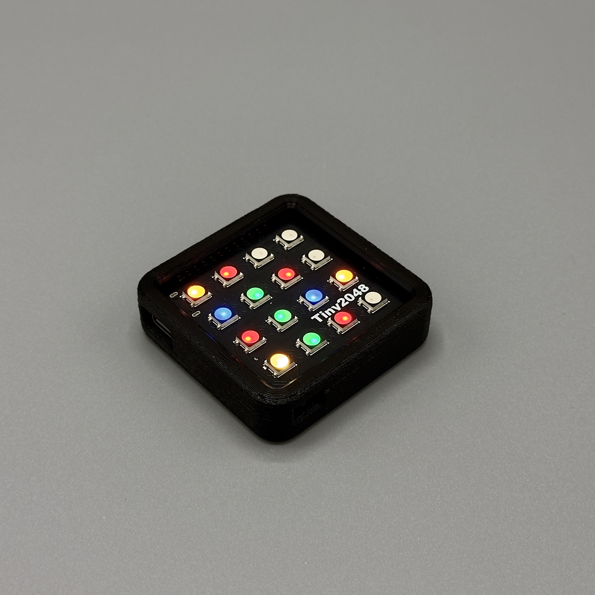

# Tiny2048

A custom ESP32 dev board with a built in 4x4 RGB LED Matrix and accelerometer.

Built to run an RGB version of 2048 - a simple but addictive game where you try to add up to 2048 by combining matching numbers on sliding tiles. 

Read more about the project at [https://hackaday.io/project/197115-tiny2048](https://hackaday.io/project/197115-tiny2048)
